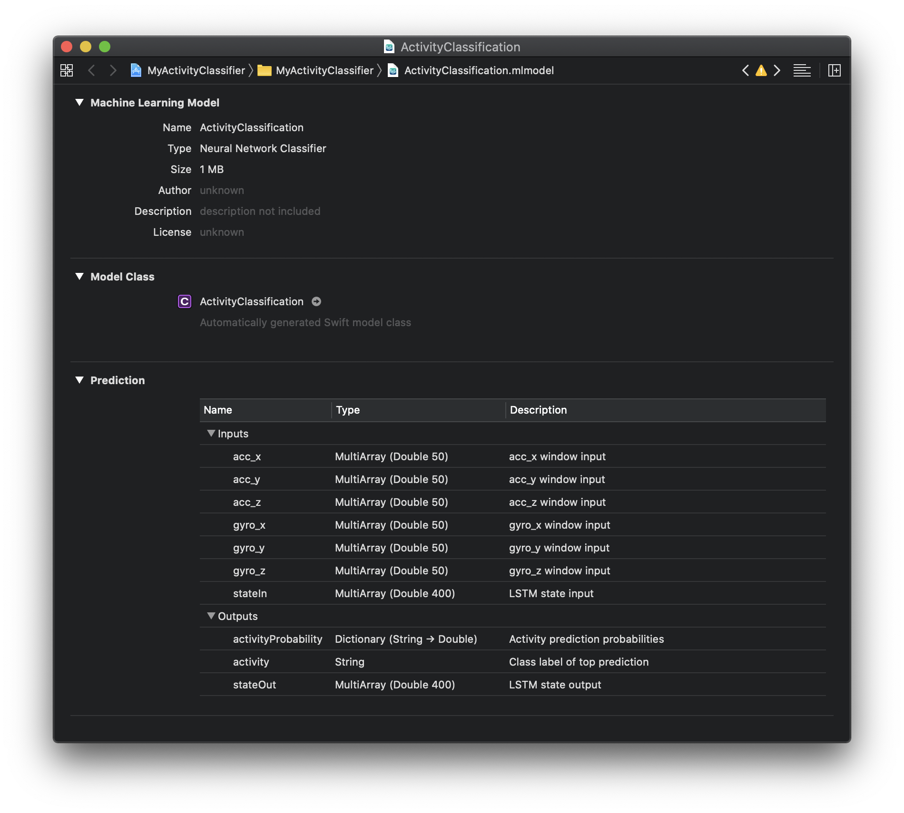
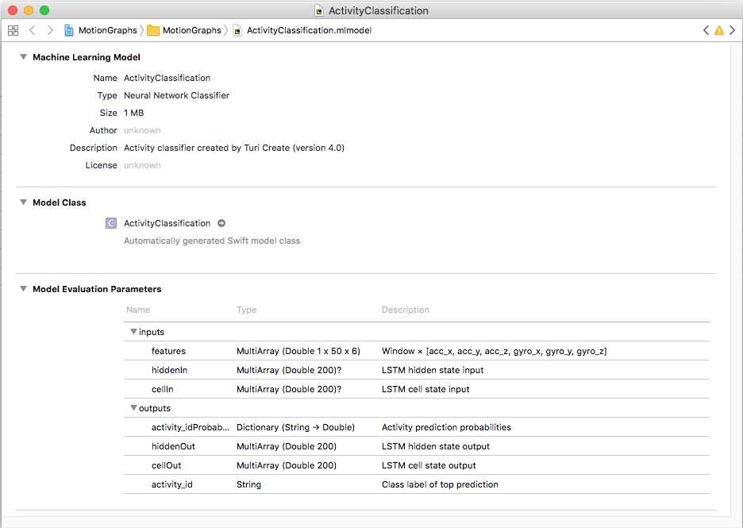

# Deploying to Core ML

In this section, we describe how to export the model created by the activity classifier toolkit to Core ML, and use it in Xcode to get real-time predictions in a Swift app.

Exporting an activity classifier model in Core ML format can be performed using the `export_coreml` function.

```python
model.export_coreml('ActivityClassification.mlmodel')
```

## Deployment With Turi Create 6.0+

Starting with Turi Create 6.0, the API for integrating an Activity Classifier into your Swift app has become more explicit. There are now individual features for the accelerometer and gyroscope on x, y, and z axes. Dragging the saved model to Xcode will automatically generate relevant code for calling the model in your app:



For more information about the generated programmatic API, please refer to [Core ML documentation](https://developer.apple.com/documentation/coreml/integrating_a_core_ml_model_into_your_app).

##### Model Inputs

* **acc_x** - an array in the length of ```prediction_window``` containing the accelerometer's X-axis readings.
* **acc_y** - an array in the length of ```prediction_window``` containing the accelerometer's Y-axis readings.
* **acc_z** - an array in the length of ```prediction_window``` containing the accelerometer's Z-axis readings.
* **gyro_x** - an array in the length of ```prediction_window``` containing the gyroscope's X-axis readings.
* **gyro_y** - an array in the length of ```prediction_window``` containing the gyroscope's Y-axis readings.
* **gyro_z** - an array in the length of ```prediction_window``` containing the gyroscope's Z-axis readings.
* **stateIn** - cell state input for the model's LSTM recurrent layer. Initialize to zero when starting a new session, otherwise should be fed with the last `stateOut` output of the previous prediction.

##### Model Outputs

* **activityProbability** - a dictionary, where the keys are each possible label (predicted activity) and the values are the activity's predicted probability, a double in the range [0.0, 1.0].
* **activity** - a string representing the predicted activity. This is the activity with the highest probability value in `activityProbability`.
* **stateOut** - cell state output of the model's LSTM recurrent layer. This output should be saved and fed to the model's `stateIn` input at the next prediction call.

For more information on the model architecture, please see the [how does it work?](how-it-works.md) section.

## Applying the Core ML model in an app
Deploying an activity classification model in an iOS/watchOS app involves 3 basic steps:

1. Enabling the relevant sensors, and setting them to provide readings at the desired frequency.
2. Aggregating the readings from the sensors into the accelerometer and gyroscope `MLMultiArray`s.
3. When the arrays fill, calling the model's `prediction()` method to get a predicted activity.

#### Creating arrays for aggregating inputs
The ActivityClassifier model expects to receive `MLMultiArray` arrays containing readings of the sensors' values.
The app will need to aggregate the sensors' readings into a `MLMultiArray` with a dimension of `prediction_window`.

Finally, the app needs to save the last `stateOut` outputs, to be fed to the model in the next prediction.

```swift
struct ModelConstants {
    static let predictionWindowSize = 50
    static let sensorsUpdateInterval = 1.0 / 50.0
    static let stateInLength = 400
}

let activityClassificationModel = ActivityClassification()
var currentIndexInPredictionWindow = 0

let accelDataX = try! MLMultiArray(shape: [ModelConstants.predictionWindowSize] as [NSNumber], dataType: MLMultiArrayDataType.double)
let accelDataY = try! MLMultiArray(shape: [ModelConstants.predictionWindowSize] as [NSNumber], dataType: MLMultiArrayDataType.double)
let accelDataZ = try! MLMultiArray(shape: [ModelConstants.predictionWindowSize] as [NSNumber], dataType: MLMultiArrayDataType.double)

let gyroDataX = try! MLMultiArray(shape: [ModelConstants.predictionWindowSize] as [NSNumber], dataType: MLMultiArrayDataType.double)
let gyroDataY = try! MLMultiArray(shape: [ModelConstants.predictionWindowSize] as [NSNumber], dataType: MLMultiArrayDataType.double)
let gyroDataZ = try! MLMultiArray(shape: [ModelConstants.predictionWindowSize] as [NSNumber], dataType: MLMultiArrayDataType.double)

var stateOutput = try! MLMultiArray(shape:[ModelConstants.stateInLength as NSNumber], dataType: MLMultiArrayDataType.double)
let motionManager = CMMotionManager()
```

#### Enabling CoreMotion sensors
We need to enable the accelerometer and gyroscope sensors, set them to the required update interval, and set our handler block.
For more info on using CoreMotion sensors, please see [CoreMotion documentation](https://developer.apple.com/documentation/coremotion)

```swift
guard motionManager.isAccelerometerAvailable, motionManager.isGyroAvailable else { return }

motionManager.accelerometerUpdateInterval = TimeInterval(ModelConstants.sensorsUpdateInterval)
motionManager.gyroUpdateInterval = TimeInterval(ModelConstants.sensorsUpdateInterval)

motionManager.startAccelerometerUpdates(to: .main) { accelerometerData, error in
    guard let accelerometerData = accelerometerData else { return }

    // Add the current data sample to the data array
    self.addAccelSampleToDataArray(accelSample: accelerometerData)
}
```
For simplicity, we only show here setting the accelerometer’s block handler.

#### Aggregating sensor readings
Whenever a new reading has been received from the sensor, we will add it to our `prediction_window` long data array.
When the array is full, the application is ready to call the model and get a new activity prediction.

```swift
func addAccelSampleToDataArray (accelSample: CMAccelerometerData) {
    // Add the current accelerometer reading to the data array
    accelDataX[[currentIndexInPredictionWindow] as [NSNumber]] = accelSample.acceleration.x as NSNumber
    accelDataY[[currentIndexInPredictionWindow] as [NSNumber]] = accelSample.acceleration.y as NSNumber
    accelDataZ[[currentIndexInPredictionWindow] as [NSNumber]] = accelSample.acceleration.z as NSNumber

    // Update the index in the prediction window data array
    currentIndexInPredictionWindow += 1

    // If the data array is full, call the prediction method to get a new model prediction.
    // We assume here for simplicity that the Gyro data was added to the data arrays as well.
    if (currentIndexInPredictionWindow == ModelConstants.predictionWindowSize) {
        if let predictedActivity = performModelPrediction() {

            // Use the predicted activity here
            // ...

            // Start a new prediction window
            currentIndexInPredictionWindow = 0
        }
    }
}
```
#### Making predictions
After `prediction_window` readings are aggregated, we call the model to get a prediction of the current user's activity.

```swift
func performModelPrediction () -> String? {
    // Perform model prediction
    let modelPrediction = try! activityClassificationModel.prediction(acc_x: accelDataX, acc_y: accelDataY, acc_z: accelDataZ, gyro_x: gyroDataX, gyro_y: gyroDataY, gyro_z: gyroDataZ, stateIn: stateOutput)

    // Update the state vector
    stateOutput = modelPrediction.stateOut

    // Return the predicted activity - the activity with the highest probability
    return modelPrediction.activity
}
```

## Deployment With Turi Create 5.0+

Dragging the saved model to Xcode will automatically generate relevant code for calling the model in your app:



For more information about the generated programmatic API please refer to [Core ML documentation](https://developer.apple.com/documentation/coreml/integrating_a_core_ml_model_into_your_app).

##### Model Inputs

* **features** - an array in the length of ```prediction_window``` and width equal to the number of features. The array should contain the sensors' readings, that have been aggregated for the past `prediction_window` samples.
* **hiddenIn** - state input for the model's LSTM recurrent layer. Initialize to zero when starting a new session, otherwise should be fed with the last `hiddenOut` output of the previous prediction.
* **cellIn** - cell state input for the model's LSTM recurrent layer. Initialize to zero when starting a new session, otherwise should be fed with the last `cellOut` output of the previous prediction.

##### Model Outputs

* **activity_idProbability** - a dictionary, where the keys are each possible label (predicted activity) and the values are the activity's predicted probability - a double in the range [0.0, 1.0].
* **activity_id** - a string representing the predicted activity. This is the activity with the highest probability value in `activity_idProbability`.
* **hiddenOut** - state output of the model's LSTM recurrent layer. This output should be saved and fed to the model's `hiddenIn` input at the next prediction call.
* **cellOut** - cell state output of the model's LSTM recurrent layer. This output should be saved and fed to the model's `cellIn` input at the next prediction call.

For more information on the model architecture, please see the [how does it work?](how-it-works.md) section.
## Applying the Core ML model in an app
Deploying an activity classification model in an iOS/watchOS app involves 3 basic steps:

1. Enabling the relevant sensors, and setting them to provide readings at the desired frequency.
2. Aggregating the readings from the sensors into a `prediction_window` long array.
3. When the array gets full - calling the model's `prediction()` method to get a predicted activity.

#### Creating arrays for aggregating inputs
The ActivityClassifier model expects to receive an array containing `prediction_window` readings of the sensors' values.
The app will need to aggregate the sensors' readings into a `MLMultiArray` with dimensions 1 x `prediction_window` x  `number_of_features`.

In addition, the app needs to save the last `hiddenOut` and `cellOut` outputs, to be fed to the model in the next prediction.


```swift
struct ModelConstants {
    static let numOfFeatures = 6
    static let predictionWindowSize = 50
    static let sensorsUpdateInterval = 1.0 / 50.0
    static let hiddenInLength = 200
    static let hiddenCellInLength = 200
}

let activityClassificationModel = ActivityClassification()

var currentIndexInPredictionWindow = 0
let predictionWindowDataArray = try? MLMultiArray(shape: [1 , ModelConstants.predictionWindowSize , ModelConstants.numOfFeatures] as [NSNumber], dataType: MLMultiArrayDataType.double)
var lastHiddenOutput = try? MLMultiArray(shape:[ModelConstants.hiddenInLength as NSNumber], dataType: MLMultiArrayDataType.double)
var lastHiddenCellOutput = try? MLMultiArray(shape:[ModelConstants.hiddenCellInLength as NSNumber], dataType: MLMultiArrayDataType.double)
```

#### Enabling CoreMotion sensors
We need to enable the accelerometer and gyroscope sensors, set them to the required update interval, and set our handler block.
For more info on using CoreMotion sensors please see [CoreMotion documentation](https://developer.apple.com/documentation/coremotion)

```swift
guard let motionManager = motionManager, motionManager.isAccelerometerAvailable && motionManager.isGyroAvailable else { return }

motionManager.accelerometerUpdateInterval = TimeInterval(ModelConstants.sensorsUpdateInterval)
motionManager.gyroUpdateInterval = TimeInterval(ModelConstants.sensorsUpdateInterval)

motionManager.startAccelerometerUpdates(to: .main) { accelerometerData, error in
    guard let accelerometerData = accelerometerData else { return }

    // Add the current data sample to the data array
    self.addAccelSampleToDataArray(accelSample: accelerometerData)
}
```
For simplicity, we only show here setting the accelerometer’s block handler.
#### Aggregating sensor readings
Whenever a new reading has been received from the sensor, we will add it to our `prediction_window` long data array.
When the array is full, the application is ready to call the model and get a new activity prediction.

```swift
func addAccelSampleToDataArray (accelSample: CMAccelerometerData) {
    // Add the current accelerometer reading to the data array
    guard let dataArray = predictionWindowDataArray else { return }
    dataArray[[0, currentIndexInPredictionWindow, 0] as [NSNumber]] = accelSample.acceleration.x as NSNumber
    dataArray[[0, currentIndexInPredictionWindow, 1] as [NSNumber]] = accelSample.acceleration.y as NSNumber
    dataArray[[0, currentIndexInPredictionWindow, 2] as [NSNumber]] = accelSample.acceleration.z as NSNumber

    // Update the index in the prediction window data array
    currentIndexInPredictionWindow += 1

    // If the data array is full, call the prediction method to get a new model prediction.
    // We assume here for simplicity that the Gyro data was added to the data array as well.
    if (currentIndexInPredictionWindow == ModelConstants.predictionWindowSize) {
        let predictedActivity = performModelPrediction() ?? "N/A"

        // Use the predicted activity here
        // ...

        // Start a new prediction window
        currentIndexInPredictionWindow = 0
    }
}
```
#### Making predictions
After `prediction_window` readings are aggregated, we call the model to get a prediction of the current user's activity.

```swift
func performModelPrediction () -> String? {
    guard let dataArray = predictionWindowDataArray else { return "Error!"}

    // Perform model prediction
    let modelPrediction = try? activityClassificationModel.prediction(features: dataArray, hiddenIn: lastHiddenOutput, cellIn: lastHiddenCellOutput)

    // Update the state vectors
    lastHiddenOutput = modelPrediction?.hiddenOut
    lastHiddenCellOutput = modelPrediction?.cellOut

    // Return the predicted activity - the activity with the highest probability
    return modelPrediction?.activity_id
}
```
