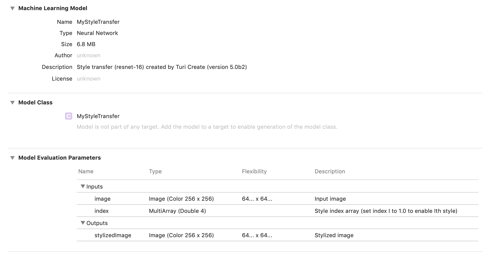

# Deployment to Core ML

Style transfer models created in Turi Create can easily be deployed to
Core ML into an iOS or macOS application.

#### Export to Core ML {#coreml}

Exporting the trained style transfer model is done using:
```python
model.export_coreml('MyStyleTransfer.mlmodel')
```

This Core ML model takes an input image and index of type MultiArray and
outputs a stylizedImage.

Drag and drop MyStyleTransfer.mlmodel into your Xcode project and add it
to your app by ticking the appropriate Target Membership check box.  An
arrow next to MyCustomStyleTransfer should appear:



If your style transfer model has 8 styles and you want to stylize using
the 4th style, then index should be

```swift
let numStyles  = 8
let styleIndex = 3

let styleArray = try? MLMultiArray(shape: [numStyles] as [NSNumber], dataType: MLMultiArrayDataType.double)

for i in 0...((styleArray?.count)!-1) {
    styleArray?[i] = 0.0
}
styleArray?[styleIndex] = 1.0
```

Now, you can stylize your images using:
```swift

// Assumes that you have a `ciImage` variable

// initialize model
let model = MyStyleTransferModel()

// set input size of the model
let modelInputSize = CGSize(width: 600, height: 600)

// create a cvpixel buffer
var pixelBuffer: CVPixelBuffer?
let attrs = [kCVPixelBufferCGImageCompatibilityKey: kCFBooleanTrue,
             kCVPixelBufferCGBitmapContextCompatibilityKey: kCFBooleanTrue] as CFDictionary
CVPixelBufferCreate(kCFAllocatorDefault,
                    modelInputSize.width,
                    modelInputSize.height,
                    kCVPixelFormatType_32BGRA,
                    attrs,
                    &pixelBuffer)

// put bytes into pixelBuffer
let context = CIContext()
context.render(ciImage, to: pixelBuffer!)

// predict image
let output = try? model.prediction(image: pixelBuffer!, index: styleArray!)
let predImage = CIImage(cvPixelBuffer: (output?.stylizedImage)!)

```
