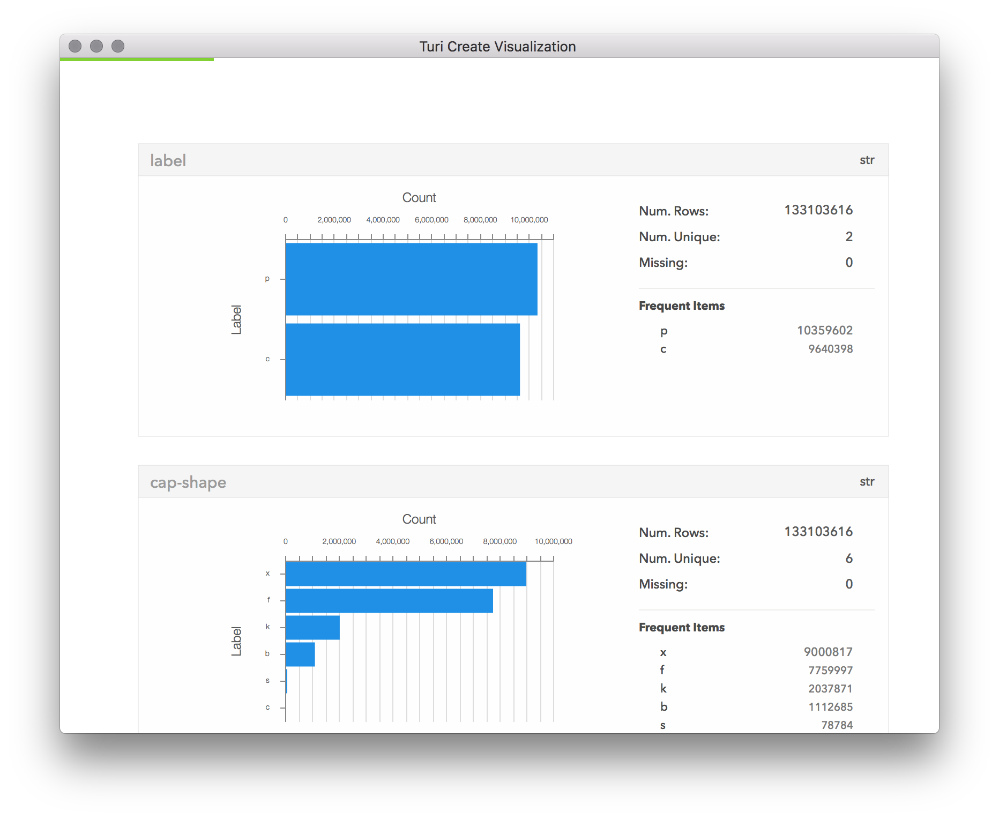
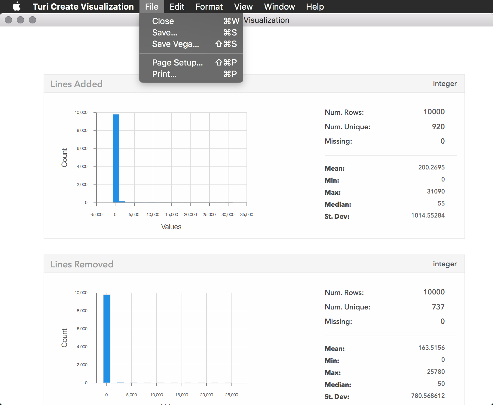
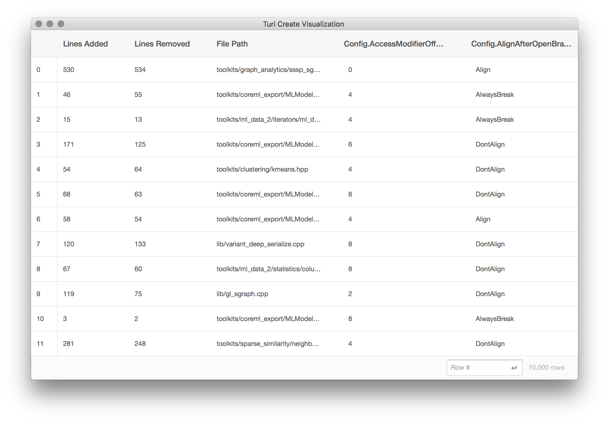

# Visualizing Data

Data visualization can help us explore, understand, and gain insight from data.
Visualization can complement other methods of data analysis by taking advantage
of the human ability to recognize patterns in visual information. Turi Create
provides one- and two-dimensional plotting capability, as well as an
interactive way to explore the contents of a data structure.

Turi Create data structures can also be used with other visualization libraries
like [matplotlib](https://matplotlib.org). You can use any Turi Create data
structure with matplotlib and other libraries by converting to a Python list,
Pandas DataFrame, Pandas Series, and/or numpy array, depending on what the
library expects. In this section we'll focus on the built in visualization
methods in Turi Create, which are purpose-built for the types of data
visualization commonly used in machine learning tasks, and support very large
datasets through streaming aggregation.

#### Visualization Methods

There are three primary visualization methods in Turi Create:

* `show` produces a plot summarizing the data structure; the specific plot
  rendered is determined automatically by the type of data structure, the
  underlying type of the data structure (`dtype`), and the number of rows of
  data. See
  [SFrame.show](https://apple.github.io/turicreate/docs/api/generated/turicreate.SFrame.show.html)
  and
  [SArray.show](https://apple.github.io/turicreate/docs/api/generated/turicreate.SArray.show.html).
* `turicreate.show(x=, y=)` produces a two-dimensional plot of an
  SArray on the X axis, and an SArray on the Y axis. The specific plot rendered
  is determined automatically by the underlying `dtype` of both `x` and `y`.
  See
  [turicreate.show](https://apple.github.io/turicreate/docs/api/generated/turicreate.show.html).
* `explore` opens an interactive view of the data structure. For SFrame and
  SArray, this takes the form of a scrollable table of rows and columns of
  data. See
  [SFrame.explore](https://apple.github.io/turicreate/docs/api/generated/turicreate.SFrame.explore.html)
  and
  [SArray.explore](https://apple.github.io/turicreate/docs/api/generated/turicreate.SArray.explore.html).

Turi Create also enables you to create independent plots including
[scatter plots](https://apple.github.io/turicreate/docs/api/generated/turicreate.visualization.scatter.html),
[heatmaps](https://apple.github.io/turicreate/docs/api/generated/turicreate.visualization.heatmap.html),
[categorical heatmaps](https://apple.github.io/turicreate/docs/api/generated/turicreate.visualization.categorical_heatmap.html),
[histograms](https://apple.github.io/turicreate/docs/api/generated/turicreate.visualization.histogram.html),
[columnwise summaries](https://apple.github.io/turicreate/docs/api/generated/turicreate.visualization.columnwise_summary.html), and
[item frequency plots](https://apple.github.io/turicreate/docs/api/generated/turicreate.visualization.item_frequency.html).

#### Show

The `show` method displays a plot of the requested data structure or pair of
data structures to the user, with an automatically selected plot type. When in
Jupyter Notebook, it outputs to the notebook by default, and otherwise opens a
native window or in a web browser. This behavior can be controlled with
[`turicreate.visualization.set_target`](https://apple.github.io/turicreate/docs/api/generated/turicreate.visualization.set_target.html).

##### Streaming Capability

Visualizations produced by `show` mostly involve aggregated data. Some examples
of aggregation used in Turi Create visualization include
[histogram binning](https://en.wikipedia.org/wiki/Histogram), used in the
histogram and heat map plots, and
[count distinct](https://en.wikipedia.org/wiki/Count-distinct_problem), used in
the summary statistics in `SFrame.show`. These aggregations can take a long
time to perform on a large dataset.

To enable you to see the plot immediately, Turi Create runs these aggregators
in a streaming fashion, operating on small batches of data and updating the
plot when each batch is complete. This helps you make decisions about what to
do next, by giving you an immediate (but partial) view of the dataset, rather
than waiting until the aggregation is complete.

While aggregation is happening, a green progress bar is shown at the top of the
plot area (see screenshot below). The progress bar will disappear once
aggregation has finished.



##### One-Dimensional Plots

The `show` method on `SArray` produces a summary of the data in the SArray. For
numeric data (`int` or `float`), this shows a numeric
[histogram](https://en.wikipedia.org/wiki/Histogram) of the data.
For categorical data (`str`), this shows a
[bar chart](https://en.wikipedia.org/wiki/Bar_chart)
representing the counts of frequently occurring items, sorted by count. The
`show` method on SFrame produces a summary of each column of the SFrame, using
the plot types described for `SArray.show`.

##### Two-Dimensional Plots

In addition to the `show` method available on individual data structures, the
`turicreate.show` method takes two parameters (`x` and `y`) to plot two data
structures, one on each dimension. The `x` and `y` parameters must both be
SArrays of the same length. The specific plot type shown depends on the
underlying `dtype` of `x` and `y` as follows:

* If both `x` and `y` are numeric, and larger than 5,000 rows, a numeric
    [heat map](https://en.wikipedia.org/wiki/Heat_map) is shown.
* If `x` and `y` are numeric, and smaller than or equal to 5,000 rows, a
    [scatter plot](https://en.wikipedia.org/wiki/Scatter_plot) is shown.
* If one is numeric and the other is categorical, a
  [box plot](https://en.wikipedia.org/wiki/Box_plot) is shown.
* If both are categorical, a categorical (discrete) heat map is shown.

##### Approximation

In order to stream plots on very large datasets, we use some highly accurate
approximate aggregators from
[Sketch](https://apple.github.io/turicreate/docs/api/generated/turicreate.Sketch.html#turicreate.Sketch):

* `Num. Unique` in `SFrame.show` uses `num_unique`.
* `Median` in `SFrame.show` and `SArray.show` for `int` and `float` columns uses `quantile`.
* Counts shown in the plot for categorical item frequency in `SFrame.show` and `SArray.show` on `str` columns use `frequent_items`.
* All numeric values in Box Plots use `quantile`.

All other values shown in Turi Create visualizations are calculated exactly.

##### Plot Customization through the API

Most `show` methods have optional parameters for specifying some plot
configurations:

* `title=` sets the title of the plot for `SArray.show` and `turicreate.show`,
  or the title of the exploration UI for `SFrame.explore` and `SArray.explore`.
* `xlabel=` sets the label of the X axis for `SArray.show` and `turicreate.show`.
* `ylabel=` sets the label of the Y axis for `SArray.show` and `turicreate.show`.

These customizations are especially useful when arranging several visualization
windows side-by-side for comparison.

##### Saving Plots

Visualizations produced with `show` allow you to save the rendered plot image
(`Save...` produces a `.png` file) or
[Vega specification](https://vega.github.io/vega/docs/specification/)
(`Save Vega...` produces a `.json` file). An image representation will allow
you to share, publish, or view the rendered plot, while the Vega specification
allows for customization of the rendered plot using a variety of tools that
support Vega specifications, like the
[online editor](https://vega.github.io/editor/#/).
You can find these options in the `File` menu as shown below:



Turi Create also lets you save plots as PNG, SVG, or JSON as part of the
Python Plot API. You can save a Plot object by invoking the `save` method, as
shown in the example below:

```
import turicreate as tc
# build the plot
x = tc.SArray([1,2,3,4,5])
y = x * 2
custom_plot = tc.visualization.scatter(x,y)
# save the plot
custom_plot.save("custom.json")
custom_plot.save("custom.png")
custom_plot.save("custom.svg")
```

#### Explore

The `explore` method allows for interactive exploration of the dataset,
including raw (non-aggregated) data. This takes the form of a
scrollable table capable of showing all rows and columns from the dataset:



Unlike `show`, the result of `explore` cannot be saved to `.png` or exported as
a Vega specification.

#### See also

To see examples of all the possible visualizations you can get from Turi
Create, see the [gallery](gallery.md). For a walk-through of when and why to
use visualization in the process of feature engineering, see
[sample use cases](use_cases.md).
For specific methods and their API parameters, see:

* [SFrame.explore](https://apple.github.io/turicreate/docs/api/generated/turicreate.SFrame.explore.html)
* [SFrame.show](https://apple.github.io/turicreate/docs/api/generated/turicreate.SFrame.show.html)
* [SArray.explore](https://apple.github.io/turicreate/docs/api/generated/turicreate.SArray.explore.html)
* [SArray.show](https://apple.github.io/turicreate/docs/api/generated/turicreate.SArray.show.html)
* [turicreate.show](https://apple.github.io/turicreate/docs/api/generated/turicreate.show.html)
